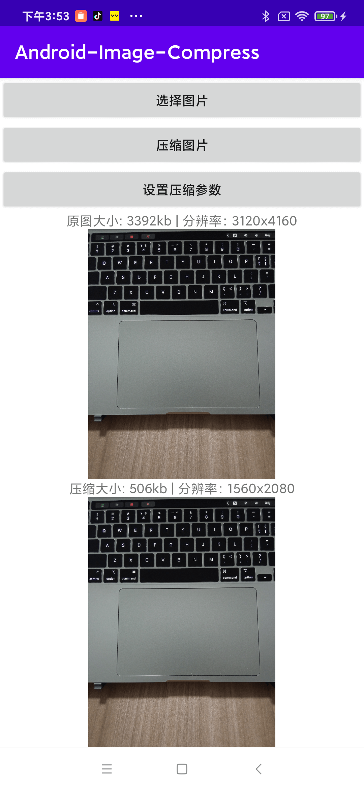

# Android-Image-Compress-Utils
Android轻量级图片压缩工具库。

[下载地址](https://github.com/zrh1994/Android-Image-Compress-Utils/releases/download/v1.0.0/image-compress-v1.0.aar)



### 使用方式
#### 1.下载AAR并添加到项目依赖中。
```groovy
implementation(name:"image-compress-v1.0", ext:"aar")
```
#### 2.调用压缩图片函数（建议在IO线程中执行）。
```kotlin
val file = ImageCompressUtils.compress(imageFile, dir, fileName, mConfig)
```